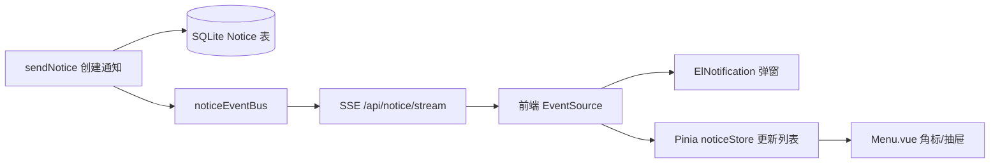

# 更新说明

## 消息通知功能

### 实时推送 (SSE)

基于 Server-Sent Events 实现服务端到客户端的实时通知推送：

- 用户登录后自动建立 SSE 长连接
- 30 秒心跳保活，断线 5 秒自动重连
- 登出时自动断开连接

### ElNotification 弹窗提醒

新通知到达时，前端自动弹出 Element Plus `ElNotification` 弹窗（右上角），无需手动刷新即可获知新消息。

### 阅读自动清理

点击通知标题标记已读后，该条通知自动从前端列表中移除，保持列表整洁。

### 通知抽屉增强

| # | 类型 | 说明 |
|---|---|---|
| 1 | ✨ | **全部已读**：抽屉标题栏新增"全部已读"按钮，一键清空所有未读通知 |
| 2 | ✨ | **单条删除**：每条通知增加删除按钮（✕），hover 时显示，点击即删除 |
| 3 | ✨ | **时间友好化**：通知时间显示为"刚刚/N分钟前/N小时前/MM-DD HH:mm"格式 |
| 4 | ✨ | **已读半透明**：已读通知以 65% 透明度显示，区分已读/未读 |
| 5 | ✨ | **点击跳转**：点击通知可直接跳转到关联页面（如稿件详情、管理界面等） |
| 6 | 🛠️ | **空态优化**：无通知时显示 `el-empty` 组件替代纯文字 |

### 用户登录通知

用户每次登录系统时，自动向管理员组发送登录通知，便于管理员了解团队活跃情况。

### API 新增

| 方法 | 路径 | 说明 |
|---|---|---|
| `GET` | `/api/notice/stream?token=xxx` | SSE 实时通知流 |
| `DELETE` | `/api/notice/:id` | 删除单条通知 |
| `POST` | `/api/notice/read-all` | 全部标记已读 |

### 架构变更

### 影响范围

| 文件 | 变更 |
|---|---|
| `Server/utils/noticeEventBus.js` | 🆕 SSE 事件总线 |
| `Server/utils/noticeSend.js` | 通知创建后触发 SSE 推送 |
| `Server/routes/notice.js` | 新增 SSE 流、删除、全部已读端点 |
| `Server/routes/auth.js` | 登录成功后发送管理员通知 |
| `Client/src/store/notification.js` | 🆕 通知 Pinia Store（SSE + 列表管理） |
| `Client/src/components/Menu.vue` | 重构通知抽屉，接入 Store |
