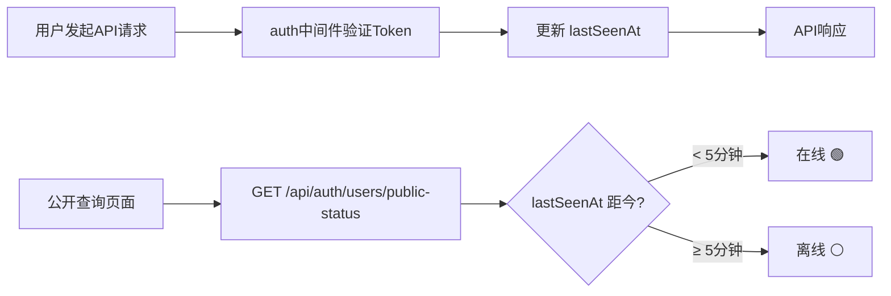

# 更新说明

## 用户在线状态

### 在线追踪

基于请求时间戳实现用户在线状态追踪：

- 用户每次发起认证请求时，自动更新 `lastSeenAt` 时间戳
- 5 分钟内活跃的用户视为在线
- 异步更新，不阻塞正常请求响应

### 公共查询 - 用户状态

新增公开用户状态页面，无需登录即可查看所有已审核用户的在线情况：

| # | 类型 | 说明 |
|---|---|---|
| 1 | ✨ | **统计概览**：顶部卡片展示在线人数（绿色）、离线人数（灰色）、总用户数（蓝色） |
| 2 | ✨ | **用户列表**：表格展示昵称、用户组、在线/离线标签、最后活跃时间 |
| 3 | ✨ | **状态指示**：绿色圆点（含发光效果）表示在线，灰色圆点表示离线 |
| 4 | ✨ | **时间友好化**：最后活跃时间显示为"刚刚/N分钟前/N小时前/N天前/MM-DD HH:mm"格式 |
| 5 | ✨ | **菜单入口**：公共查询子菜单新增"用户状态"项，点击跳转 `/user-status` |

### API 新增

| 方法 | 路径 | 说明 |
|---|---|---|
| `GET` | `/api/auth/users/public-status` | 公开查询用户在线状态（无需登录） |

### 工作流程

### 影响范围

| 文件 | 变更 |
|---|---|
| `Server/models/index.js` | User 模型新增 `lastSeenAt` 字段 |
| `Server/middleware/auth.js` | 认证通过后自动更新 `lastSeenAt` |
| `Server/routes/auth.js` | 新增 `GET /users/public-status` 公开端点 |
| `Client/src/views/UserStatus.vue` | 🆕 用户在线状态展示页面 |
| `Client/src/router/index.js` | 新增 `/user-status` 公开路由 |
| `Client/src/components/Menu.vue` | 公共查询子菜单新增"用户状态"入口 |